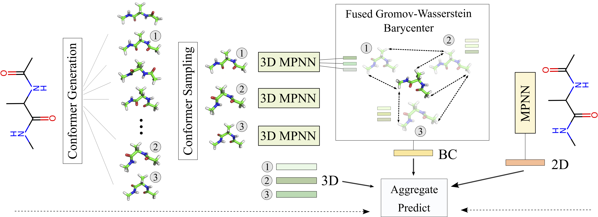

# Structure-Aware E(3)-Invariant Molecular Conformer Aggregation Networks
:fire: :fire: This repository contains PyTorch implementation for ICML 2024 paper: **Structure-Aware E(3)-Invariant Molecular Conformer Aggregation Networks [[arXiv]](https://arxiv.org/abs/2402.01975)**.

A molecule's 2D representation consists of its atoms, their attributes, and the molecule's covalent bonds. A 3D (geometric) representation of a molecule is called a conformer and consists of its atom types and Cartesian coordinates. Every conformer has a potential energy, and the lower this energy, the more likely it occurs in nature. Most existing machine learning methods for molecular property prediction consider either 2D molecular graphs or 3D conformer structure representations in isolation. Inspired by recent work on using ensembles of conformers in conjunction with 2D graph representations, we propose E(3)-invariant molecular conformer aggregation networks. The method integrates a molecule's 2D representation with that of multiple of its conformers. Contrary to prior work, we propose a novel 2D--3D aggregation mechanism based on a differentiable solver for the Fused Gromov-Wasserstein Barycenter problem and the use of an efficient online conformer generation method based on distance geometry. We show that the proposed aggregation mechanism is E(3) invariant and provides an efficient GPU implementation. Moreover, we demonstrate that the aggregation mechanism helps to significantly outperform state-of-the-art property prediction methods on established datasets.


## Table of Contents

- [Update](#update)
- [Introduction](#introduction)
- [Installation](#installation)
- [Data](#data)
- [Usage](#usage)

## Update
- May 2024: We release 1st version of codebase

## Introduction
This repository provides implementations for E(3)-invariant molecular conformer aggregation networks on a collection of 7 benchmark datasets designed to address a wide range of graph-related tasks such as classification and regression. Our implementations are built on state-of-the-art deep learning frameworks and are designed to be easily extensible and customizable.

The repository is structured as follows:

- **data/**: This directory contains scripts and utilities for downloading and preprocessing benchmark datasets.
- **output/**: This directory contains processes' outcome including logs and checkpoints.
- **scripts/**: This directory is intended to store experimental scripts.
- **src/**: This directory contains the source code for training, evaluating, and visualizing GNN models.
- **README.md**: This file contains information about the project, including installation instructions, usage examples, and a description of the repository structure.
- **environment.yml**: This file lists all Python dependencies required to run the project.
- **.gitignore**: This file specifies which files and directories should be ignored by Git version control.

## Installation

To re-produce this project, you will need to have the following dependencies installed:
- Ubuntu 18.04.6 LTS
- CUDA Version: 11.7
- [Miniconda](https://docs.conda.io/en/latest/miniconda.html)
- Python 3
- [PyTorch](https://pytorch.org/) (version 2.0 or later)
- [PyTorch Geometric](https://pytorch-geometric.readthedocs.io/en/latest/)

After installing Miniconda, you can create a new environment and install the required packages using the following commands:

```bash
conda create -n conan python=3.9
conda activate conan
pip install torch==2.0.0 torchvision==0.15.1 torchaudio==2.0.1
conda env update -n conan --file environment.yaml
```

## Data
To refer benchmark datasets, please get access this link and download it.


## Usage
The project focuses on leveraging four MoleculeNet datasets: Lipo, ESOL, FreeSolv, and BACE. Furthermore, it explores two CoV-2 datasets and one catalysts dataset known as BDE. All relevant data is stored within the `data` directory. To configure the settings for each dataset, corresponding configuration files are provided in the `src/config` folder.

To reproduce experiments, please refer:
```bash
## scripts/train.sh
ds=lipo
n_cfm=3
exp=schnet_no_sum
python src/2_train_and_eval.py \
        --config_name=src/config/$ds/$ds\_$n_cfm.yaml \
        --cuda_device=0 \
        --data_root=conan_fgw \
        --number_of_runs=3 \
        --checkpoints_dir=checkpoints \
        --run_name=$exp\_$ds\_$n_cfm \
        --run_mode=train \
        --model_name=$exp
```


## Citation
Please cite this paper if it helps your research:
<p>


</p>

```bibtex
@article{nguyen2024structure,
  title={Structure-Aware E (3)-Invariant Molecular Conformer Aggregation Networks},
  author={Nguyen, Duy MH and Lukashina, Nina and Nguyen, Tai and Le, An T and Nguyen, TrungTin and Ho, Nhat and Peters, Jan and Sonntag, Daniel and Zaverkin, Viktor and Niepert, Mathias},
  journal={International Conference on Machine Learning},
  year={2024}
}
```